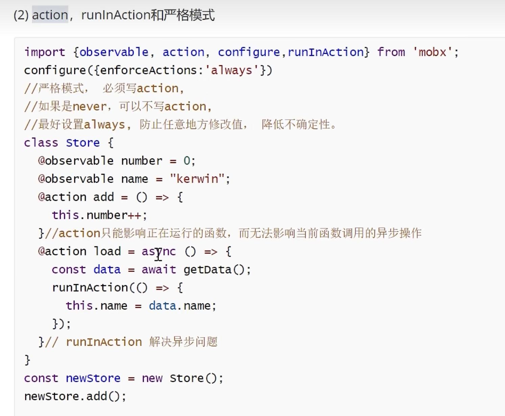

# Mobx - Action 和 runInAction

## Mobx - Action

定义**personStore.tsx** 对象，外部可以随意修改

```
import { observable } from "mobx";

const personStore = observable({
    name: "Tom",
    age: 20
})

export default personStore
```


### 严格模式

写法一：

Mobx 还有严格模式，可以做到在`personStore`内部控制数据修改。通过配置`configure`配置`enforceActions`参数

```
import { observable, configure, action } from "mobx";

configure({
    enforceActions: 'always'       // 在外部修复，会抛出异常
    //enforceActions:'never'      // 外部随便修改，默认，不检查
    //enforceActions: 'observed'  // 在观察期间使用动作时才执行检查
})

const personStore = observable({
    name: "Tom",
    age: 20,

    changeName(name: string) {
        this.name = name
    }
}, {
    changeName: action // 设置可以让外部调用，修改
})

export default personStore
```


写法二：

```
import { observable, configure, action, observe } from "mobx";

// 严格模式
configure({
    enforceActions: 'always'
})

class PersonStore {
    @observable name = "Tom";
    age = 20;

    @action changName(name: string) {
        this.name = name
    }
}

var personStore = new PersonStore()

export default personStore
```





### 报错

```
TS1219: Experimental support for decorators is a feature that is subject to change in a future release. Set the 'experimentalDecorators' option in your 'tsconfig' or 'jsconfig' to remove this warning.
```


解决方法：在` tsconfig.json`添加以下属性：

```
"experimentalDecorators":true,
"javascript.implicitProjectConfig.experimentalDecorators": true
```


### 案例

这个案例有个问题，装饰器没生效，需要一些配置

**personStore.tsx** 数据

```
import { observable, configure, action, observe } from "mobx";

// 严格模式
configure({ 
    enforceActions: 'always'
})

class PersonStore {
    @observable name = "Tom";
    age = 20;

    // 设置name可以修改
    @action changName(name: string) {
        console.log("changName")
        this.name = name
    }
}

var personStore = new PersonStore()

export default personStore
```


**App.jsx** 调用 ： ` <Provider store={personStore}>` 其中**store**可以自定义，其他组件通过这个**store**来获取数据

```
import MobxReactClass from './mobx/MobxReactClass';
import MobxReactFunc from './mobx/MobxReactFunc';
import personStore from './mobx/personStore';

function App() {
  return (
    <>
      {/* mobx-react 自动监听 ,其中 store 可以自定义名称 */}
      <Provider store={personStore}>
        <MobxReactClass></MobxReactClass>
        <MobxReactFunc></MobxReactFunc>
      </Provider>
     </> 
}
```


**MobxReactClass.tsx** 类组件

```
import { inject, observer } from 'mobx-react'
import React, { Component } from 'react'

@inject('store') // 这个 store 是外面传递什么就是什么
@observer
class MobxReactClass extends Component {
    render() {
        return (
            <>
                <button onClick={() => { this.props.store.changName("Jack") }}>upate name</button>
                <div>{this.props.store.name}</div>
            </>
        )
    }
}

export default MobxReactClass
```


**MobxReactFunc.tsx** 函数组件

```
import { Observer } from "mobx-react"
import React from "react"
import personStore from "./personStore"

export default function MobxReactFunc() {
    return (
        <>
            {/* 监听 mobx 数据 */}
            <Observer>
                {
                    () => {
                        return (
                            <>
                                <div>"MobxReactFunc " {personStore.name}</div>
                                <button onClick={()=>{
                                    personStore.changName("MobxReactFunc>>> Roy")
                                }}>change name</button>
                            </>
                        )
                    }
                }
            </Observer>
        </>
    )
}
```


## Mobx - runInAction