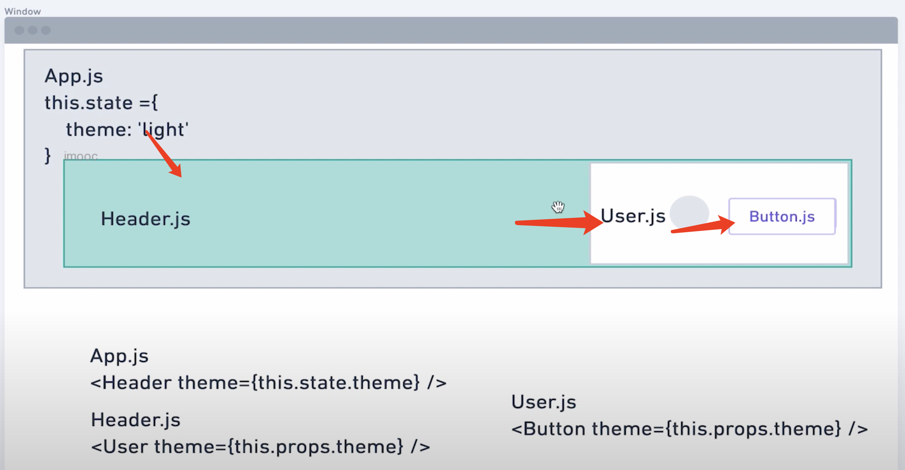

# React - 环境搭建

## React 是什么？

[React 官网](https://react.dev/learn)，React 是一个流行的 JavaScript 库，用于为网页或应用程序构建可重用的组件驱动的用户界面。


## 准备工作

- [nodejs](https://nodejs.org/en)
- [vscode](https://code.visualstudio.com/)
- vscode 插件
  - Atom One Dark Theme（主题）
  - IntelliJ IDEA Keybindings（IDE快捷键，可选）
  - ESLint（语法检测工具）
  - Prettier（代码格式化）
  - ES7+ React/Redux/React-Native snippets（快速创建React代码模板）


## create-react-app


通过官方脚手架工具[create-react-app](https://create-react-app.dev/)，创建 React 项目，有两种方式，一种是基于 Javascript 的React，还有一种是创建 Typescript 的 React。两种不同的创建方式，生成文件的后缀是不一样的，Javascript的是以`js`结尾，Typescript 的是以`tsx`。


### 创建 React 项目（Javascript)

其中`my-app-js`是项目名称，可以自定义

```
npx create-react-app my-app-js
```


创建的项目里面都是 js 文件和 css 文件，如果在项目里面写 tsx 的 Component，导入的时候，需要导入文件后缀(.tsx)，否则会出现：

```
Module not found: Error: Can't resolve './UseContextChild' in '/Users/hefeng02/myweb/my-app/src/components'
```

导入包

```
import UseContextChild from './UseContextChild.tsx'
```


### 创建 React 项目（Typescript)

其中`my-app-ts`是项目名称，可以自定义

```sh
npx create-react-app my-app-ts --template typescript
```


### 启动 React 

```
npm start
```


### 其他命令

```
Inside that directory, you can run several commands:

  npm start
    Starts the development server.

  npm run build
    Bundles the app into static files for production.

  npm test
    Starts the test runner.

  npm run eject
    Removes this tool and copies build dependencies, configuration files
    and scripts into the app directory. If you do this, you can’t go back!

We suggest that you begin by typing:

  cd my-app-ts
  npm start
```


### 拓展：npx 命令

npx

- 避免全局安装模块
- 访问局部模块

npx 是 Node.js 附带的一个工具，可以用于执行 Node.js 包中的命令。它主要用于临时安装或运行一些 Node.js 工具或脚本，而不需要将它们安装在全局环境中。它将在执行命令时自动下载所需包，并运行它们。通过使用 npx，开发者可以更轻松地管理依赖项和避免全局范围的安装。


## FunctionComponent

```
import React from "react";

interface IHello {
    message: String;
}

// FunctionComponent = FC
const Hello: React.FC<IHello> = (props: IHello) => {
    return (
        <div>{props.message}</div>
    )
}

Hello.defaultProps = {
    message: "default val"
}
export default Hello
```


## ReactHook : 函数组件

- 组件状态逻辑复用	
- 使用Hook使用函数


- 类组件
- 函数组件（ReactHook）


# useState

通过`useState`，让函数组件也能传递数据，改变组件的状态。useStateHook

### 传递数据

```
import React, { useState } from 'react'

const LikeButton: React.FC = () => {
    // like : 指数字
    // setLike：函数，设置数字
    const [like, setLike] = useState(0); // like 从0开始
    return (
        <button onClick={() => {setLike(like + 1)}}>{like} 喜欢 </button>
    )
}

export default LikeButton
```


### 传递对象

```
import React, { useState } from 'react'

const LikeButton2: React.FC = () => {
    // likeObj 是指里面的数据
    // setLikeObj 是指操作的函数
    const [likeObj, setLikeObj] = useState({
        like: 0,
        on: true
    })

    return (
        <button onClick={() => {
            setLikeObj({
                like: likeObj.like + 1, on: likeObj.on
            })
        }}>{likeObj.like} 喜欢</button>
    )
}

export default LikeButton2
```


### 拆分useState

```
import React, { useState } from 'react'

const LikeButton3: React.FC = () => {
    // 拆分
    const [like, setLike] = useState(0)
    const [on, setOn] = useState(true)

    return (
        <>
            <button onClick={() => {
                setLike(like + 1)
            }}>{like} 喜欢</button>

            <button onClick={() => {
                setOn(!on)
            }}>{on ? 'ON' : 'OFF'}</button>
        </>
    )
}

export default LikeButton3
```


## useEffect

useEffect：每次渲染后都会执行

### 触发 useEffect

```
import React, { FC, useEffect, useState } from 'react'

const UseEffect: FC = () => {
    const [count, setCount] = useState(0);
		// 点击按钮，触发渲染
    useEffect(() => {
        document.title = `${count} `
    })

    return (
        <button onClick={()=>setCount(count+1)}>click {count} count</button>
    )
}

export default UseEffect;
```

### 案例：鼠标点击，获取位置

这种方式，注册和取消，浪费资源，调用太频繁

```
import React, { FC, useEffect, useState } from 'react'

const MouseTracker: FC = () => {
    const [position, setPosition] = useState({
        x: 0,
        y: 0
    });

    useEffect(() => {
        const updateMouse = (e: MouseEvent) => {
            // 更新坐标值
            setPosition({
                x: e.clientX, y: e.clientY
            })
        }
        document.addEventListener('click', updateMouse)
        
        return () => { // useEffect 执行完的回调
            document.removeEventListener('click', updateMouse)
        }
    })

    return (
        <p>x:{position.x},y:{position.y}</p>
    )
}

export default MouseTracker;
```

### 设置useEffect执行次数

#### useEffect 执行1次

```
    useEffect(() => {
        // 执行
        
        return () => { // useEffect 执行完的回调
            // 执行结束
        }
    },[]) // []：执行1次，传递空数组

```

#### useEffect通过条件触发

默认情况下，每次渲染后都会执行，通过控制useEffect第三个参数，来触发执行

```
import React, { FC, useEffect, useState } from 'react'

const MouseTracker: FC = () => {
    const [count, setCount] = useState(0)
    const [number, setNumber] = useState(0)

    useEffect(() => {
        console.log("excute useEffect")
        return () => { // useEffect 执行完的回调
            console.log("excute useEffect end")
        }
    }, [count]) // 当 count 发生变化的时候，执行useEffect

    return (
        <React.Fragment>
            <button onClick={() => {
                setCount(count + 1)
            }}> click : {count}</button>

            <button onClick={() => {
                 setNumber(number + 1)
            }}> click number : {number}</button>
        </React.Fragment>
    )
}

export default MouseTracker;
```


## useRef

useRef：确保组件内的数据是实时最新的，多次渲染后的数据也是一致的。

用法：

```
 const useRefVal = useRef(0)
```


示例：一直点击按钮1，点击1次按钮2，看数据变化

```
import React, { useRef, useState } from "react"

const UseRefDemo = () => {
    const useRefVal = useRef(0)
    const [number, setNumber] = useState(0)

    return (
        <>
            <button onClick={() => { // 多点几次
                useRefVal.current++
                setNumber(number + 1)
                console.log("useRefVal=" + useRefVal.current + "||useStateVal=" + number)
            }}>useRef1</button>

            <button onClick={() => { // 点击1次
                setTimeout(() => {
                    alert("useRefVal = " + useRefVal.current + "||useStateVal=" + number)
                }, 2000)
            }}>useRef2</button>
        </>
    )
}

export default UseRefDemo
```


常见用法：保存 Dom 节点

```
import React, { useEffect, useRef, useState } from "react"

const UseRefDemo2 = () => {
    const useRefInput = useRef<HTMLInputElement>(null)
    const [number, setNumber] = useState(0)

    useEffect(() => {
        if (useRefInput && useRefInput.current) {
            useRefInput.current.focus()
        }
    },[number]) // number变更的时候，触发1次渲染

    return (
        <>
             {/* 记录Dom节点 */}
            <input type="text" ref={useRefInput}></input>

            <button onClick={() => {
                setNumber(number + 1)
            }}  >request input focus</button>
        </>
    )
}

export default UseRefDemo2
```


## useContext

useContext：为了解决多层组件传递数据，避免组件一层一层的传递。useContext 提供了组件内共享数据，避免组件树一层一层传递。

最常见的场景就是切换深色还是浅色模式。


