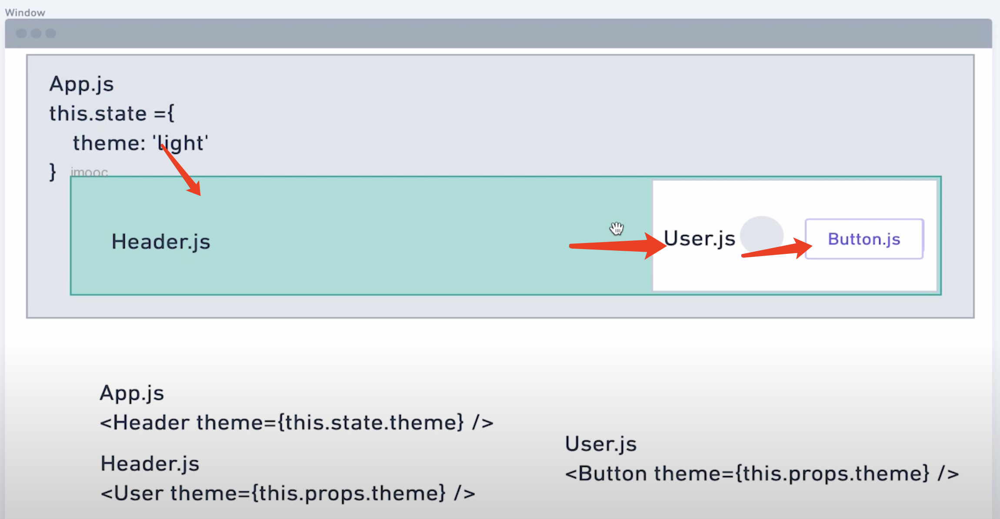

# React - ReactHook

## ReactHook 函数组件

**ReactHook 是函数组件，在类组件无法使用**， React 16.8 版本引入的一种新特性，它可以让你在不编写 class 的情况下使用 state 以及其他 React 特性，例如生命周期方法。它使得开发者更容易地编写可复用性高、逻辑清晰的组件，也使得组件间逻辑的复用更加简单。

常用的 React Hook 有 ：

- useState
- useEffect
- useContext
- useReducer

**useHooks**

useHooks：https://usehooks.com/


### 1、ReactHook - useState

通过`useState`，让函数组件也能传递数据，改变组件的状态。useStateHook

#### 传递数据

```
import React, { useState } from 'react'

const LikeButton: React.FC = () => {
    // like : 指数字
    // setLike：函数，设置数字
    const [like, setLike] = useState(0); // like 从0开始
    return (
        <button onClick={() => {setLike(like + 1)}}>{like} 喜欢 </button>
    )
}

export default LikeButton
```

#### 传递对象

```
import React, { useState } from 'react'

const LikeButton2: React.FC = () => {
    // likeObj 是指里面的数据
    // setLikeObj 是指操作的函数
    const [likeObj, setLikeObj] = useState({
        like: 0,
        on: true
    })

    return (
        <button onClick={() => {
            setLikeObj({
                like: likeObj.like + 1, on: likeObj.on
            })
        }}>{likeObj.like} 喜欢</button>
    )
}

export default LikeButton2
```

#### useState 拆分

```
import React, { useState } from 'react'

const LikeButton3: React.FC = () => {
    // 拆分
    const [like, setLike] = useState(0)
    const [on, setOn] = useState(true)

    return (
        <>
            <button onClick={() => {
                setLike(like + 1)
            }}>{like} 喜欢</button>

            <button onClick={() => {
                setOn(!on)
            }}>{on ? 'ON' : 'OFF'}</button>
        </>
    )
}

export default LikeButton3
```

### 2、ReactHook - useEffect

useEffect：每次渲染后都会执行

#### 触发 useEffect

```
import React, { FC, useEffect, useState } from 'react'

const UseEffect: FC = () => {
    const [count, setCount] = useState(0);
		// 点击按钮，触发渲染
    useEffect(() => {
        document.title = `${count} `
    })

    return (
        <button onClick={()=>setCount(count+1)}>click {count} count</button>
    )
}

export default UseEffect;
```

#### 案例：鼠标点击，获取位置

这种方式，注册和取消，浪费资源，调用太频繁

```
import React, { FC, useEffect, useState } from 'react'

const MouseTracker: FC = () => {
    const [position, setPosition] = useState({
        x: 0,
        y: 0
    });

    useEffect(() => {
        const updateMouse = (e: MouseEvent) => {
            // 更新坐标值
            setPosition({
                x: e.clientX, y: e.clientY
            })
        }
        document.addEventListener('click', updateMouse)
        
        return () => { // useEffect 执行完的回调
            document.removeEventListener('click', updateMouse)
        }
    })

    return (
        <p>x:{position.x},y:{position.y}</p>
    )
}

export default MouseTracker;
```

#### 设置useEffect执行次数

##### useEffect 执行1次

```
    useEffect(() => {
        // 执行
        
        return () => { // useEffect 执行完的回调
            // 执行结束
        }
    },[]) // []：执行1次，传递空数组

```

##### useEffect通过条件触发

默认情况下，每次渲染后都会执行，通过控制useEffect第三个参数，来触发执行

```
import React, { FC, useEffect, useState } from 'react'

const MouseTracker: FC = () => {
    const [count, setCount] = useState(0)
    const [number, setNumber] = useState(0)

    useEffect(() => {
        console.log("excute useEffect")
        return () => { // useEffect 执行完的回调
            console.log("excute useEffect end")
        }
    }, [count]) // 当 count 发生变化的时候，执行useEffect

    return (
        <React.Fragment>
            <button onClick={() => {
                setCount(count + 1)
            }}> click : {count}</button>

            <button onClick={() => {
                 setNumber(number + 1)
            }}> click number : {number}</button>
        </React.Fragment>
    )
}

export default MouseTracker;
```

### 3、ReactHook - useRef

useRef：确保组件内的数据是实时最新的，多次渲染后的数据也是一致的。

用法：

```
 const useRefVal = useRef(0)
```


示例：一直点击按钮1，点击1次按钮2，看数据变化

```
import React, { useRef, useState } from "react"

const UseRefDemo = () => {
    const useRefVal = useRef(0)
    const [number, setNumber] = useState(0)

    return (
        <>
            <button onClick={() => { // 多点几次
                useRefVal.current++
                setNumber(number + 1)
                console.log("useRefVal=" + useRefVal.current + "||useStateVal=" + number)
            }}>useRef1</button>

            <button onClick={() => { // 点击1次
                setTimeout(() => {
                    alert("useRefVal = " + useRefVal.current + "||useStateVal=" + number)
                }, 2000)
            }}>useRef2</button>
        </>
    )
}

export default UseRefDemo
```


**常见用法：保存 Dom 节点**

```
import React, { useEffect, useRef, useState } from "react"

const UseRefDemo2 = () => {
    const useRefInput = useRef<HTMLInputElement>(null)
    const [number, setNumber] = useState(0)

    useEffect(() => {
        if (useRefInput && useRefInput.current) {
            useRefInput.current.focus()
        }
    },[number]) // number变更的时候，触发1次渲染

    return (
        <>
             {/* 记录Dom节点 */}
            <input type="text" ref={useRefInput}></input>

            <button onClick={() => {
                setNumber(number + 1)
            }}  >request input focus</button>
        </>
    )
}

export default UseRefDemo2
```

### 4、ReactHook - useContext

useContext：为了解决多层组件传递数据，避免组件一层一层的传递。useContext 提供了组件内共享数据，避免组件树一层一层传递。

最常见的场景就是切换深色还是浅色模式。




**ThemeContext.tsx**

```
import React from 'react'

interface IThemeProps {
    [key: string]: { color: string; background: string; }
}

export const themes: IThemeProps = {
    'light': {
        color: '#000', background: '#eee'
    },

    'dark': {
        color: '#fff', background: '#222'
    }
}

export const ThemeContext = React.createContext(themes.light)
export default ThemeContext; 
```

**UseContextParent.tsx**

```
import React from 'react'
import UseContextChild from './UseContextChild'
import ThemeContext, { themes } from './ThemeContext'

const UseContextParent = () => {
    return (
        <> 
            <ThemeContext.Provider value={themes.dark}>
                <p>UseContextParent</p>
                <UseContextChild></UseContextChild>
            </ThemeContext.Provider>
        </>
    )
}

export default UseContextParent
```

**UseContextChild.tsx**

```
import React, { useContext } from 'react'
import ThemeContext from './ThemeContext'

const UseContextChild = () => {
    // 接收到的 theme 数据
    const theme = useContext(ThemeContext)
    console.log("theme="+theme)
    const style = {
        background: theme.background,
        color: theme.color,
    }

    return (
        <>
            <p style={style}>UseContextChild</p>
        </>
    )
}

export default UseContextChild
```

use

```
 <UseContextParent></UseContextParent>
```

## 自定义 ReackHook

ReackHook 的规则：

- 函数名称必须以`use`开头，比如 useMouseTracker
- 只在最顶层使用 Hook
- 只在React 函数中定义 Hook

#### 自定义 Hook - useMousePosition

移动鼠标，获取坐标 

```
/hook/useMousePosition.tsx
```

```
import React, { useEffect, useState } from 'react'

const useMousePosition = () => {
    const [position, setPosition] = useState({
        x: 0,
        y: 0
    })

    useEffect(() => {
        const updateMouse = (e: MouseEvent) => {
            setPosition({
                x: e.clientX,
                y: e.clientY
            })
        }
        document.addEventListener("mousemove", updateMouse)

        return () => {
            document.removeEventListener("mousemove", updateMouse)
        }
    }, []) // 执行1次

    return position
}

export default useMousePosition
```

调用

```
import React from 'react'
import useMousePosition from '../hooks/useMousePosition.tsx'

const MousePosition = () => {
    const position = useMousePosition()

    return (
        <h1>x:{position.x} y:{position.y}</h1>
    )
}

export default MousePosition
```

#### 自定义Hook - useURLLoader

网络请求

```
import React, { useEffect, useState } from 'react'
import axios from 'axios'

// 默认执行1次
const useURLLoader = (url: string, deps: any[] = []) => {
    const [data, setData] = useState<any>(null)
    const [loading, setLoading] = useState(false)

    useEffect(() => {
        setLoading(true)
        axios.get(url).then(result => {
            setData(result)
        })
    }, deps)

    return [data, loading]
}
```

使用

```
import React, { useState } from 'react'
import useURLLoader from '../hooks/useURLLoader.tsx'

interface ILoadData {
    src: string;
    message: string;
    status: string;
}

const ImageList: React.FC<{ data: ILoadData }> = () => {
    const [show, setShow] = useState(false)
    const [data, loading] = useURLLoader("https://www.baidu.com", [show]) // show变更的时候触发
    // 一定要确定，数据格式和ILoadData一样
    const resData =  data as ILoadData

    return (
        <>
            <h1>{resData.message}</h1>
            
        </>
    )
}

export default ImageList
```


## HOC

React 官方的高阶组件，不太好用