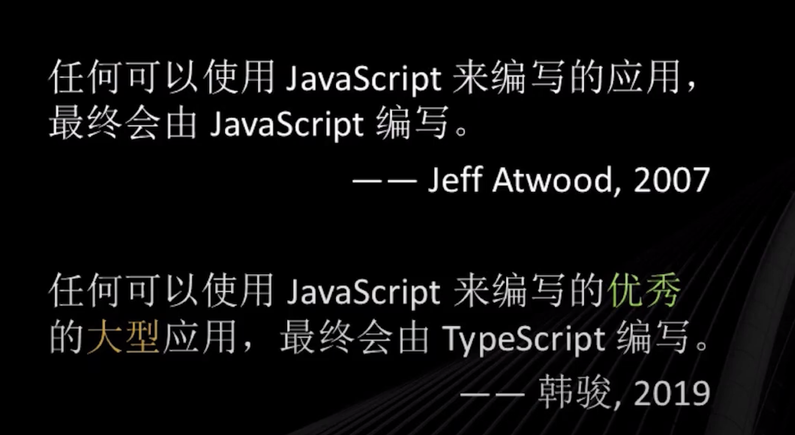

# Typescript - 简介


## Typescript 语言是什么？


文档教程：https://vikingship.xyz/?path=/docs/welcome--page


### 编程语言

- 动态类型语言：在运行期间，才进行数据类型检查。编程的时候，不用指定数据类型，比如：python、javascript
- 静态类型语言：在编译期间，就进行数据类型检查。编程的时候需要指定数据类型，比如：Java、C/C++


### Typescript 简介

Typescript 就是将不关注类型的语言，支持成关注数据类型的语言。支持es6-es10的语法，静态类型风格的类型系统，兼容各种浏览器，并且开源的软件。动态类型语言出现错误的时候，只能通过调试，才能找出问题。


官方网址：https://www.typescriptlang.org/




## Typescript 安装

1、安装 typescript

```
npm install -g typescript
```


2、安装指定版本

```
npm install -g typescript@5.0.2
```


3、查看typescript版本

```
tsc -v
```


## Typescript 编译运行

1、新建 hello.ts 文件

```
const hello = (name: String) => {
    return `Hello ${name}`
}

hello("zhangsan")
```

2、编译 

Typescript是不能直接运行的，需要编译成 js文件

```
tsc hello.ts 
```


hello.ts 文件

```
var hello = function (name) {
    return "Hello ".concat(name);
};
hello("zhangsan");
```

可以发现 Typescript 转成的 js 文件，并没有类型，Typescript的类型检查是在编译的时候，如果输入的类型不是String，编译的时候就会报错。


3、运行

```
node hello.ts
```


4、比如传递数字`hello(123);`编译就会报错

```
hello.ts:5:7 - error TS2345: Argument of type 'number' is not assignable to parameter of type 'String'.

5 hello(123)
        ~~~


Found 1 error in hello.ts:5
```

