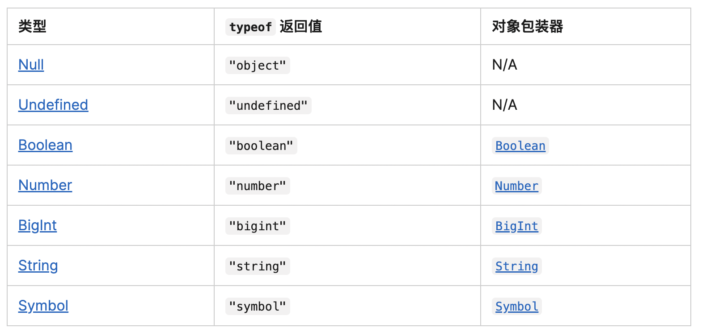

# Typescript - 数据类型

## 数据类型

1、基础类型（javascript）

- MDN 数据类型：https://developer.mozilla.org/zh-CN/docs/Web/JavaScript/Data_structures



- BigInt：ES6 新增
- Symbol：ES6 新增


对应 Typescript 类型写法

```
let isState: boolean = false

let age: number = 100

let a = "Joy" // 类型推论，自动推断出是string

let binaryNumber: number = 0b101011 // 八进制，ES6 写法

let firstName: string = "Tom"

let message = `hello , ${firstName}`

let u: undefined = undefined  // 所有类型的子类型
let n: null = null // 所有类型的子类型

let numN: number = undefined
```


2、any类型

 可以是任意类型，可以调用方法和属性，非常随意，不建议使用。

```
let a: any = 3 // any 是任意类型
a = "hi"
a = true
a.name = "123"
a.getName()
```


3、联合类型

```
// 代表变量既可以是数字或者字符串
let numberOrString: number | string = 1
numberOrString = "hi"
```


4、自动推断类型

```
let a = 1
let b = "Tom"

function getName() {
    return "Tom"
}
```


## 数据结构

1、数组：聚会相同类型的数据

```
// 写法一
let arrNumber: number[] = [1, 2, 3, 4]
arrNumber.push(5)
// 写法二
let arrNumber2: Array<number> = [1, 2, 3, 4]
arrNumber2.push(5)
```


```
function clsArray() {
    // 类数组
    console.log(arguments)
}
```


2、元组

```
// 第一位只能是字符串，第二位是数字
let uer: [string, number] = ['zhangsan', 26]
```

